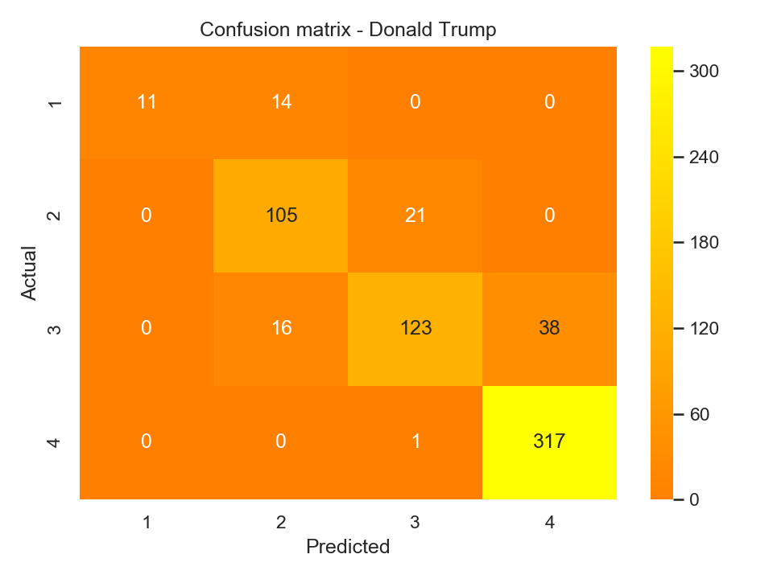
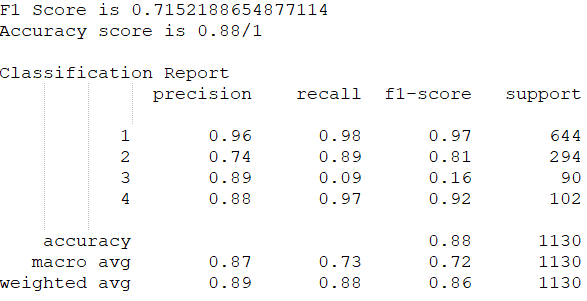
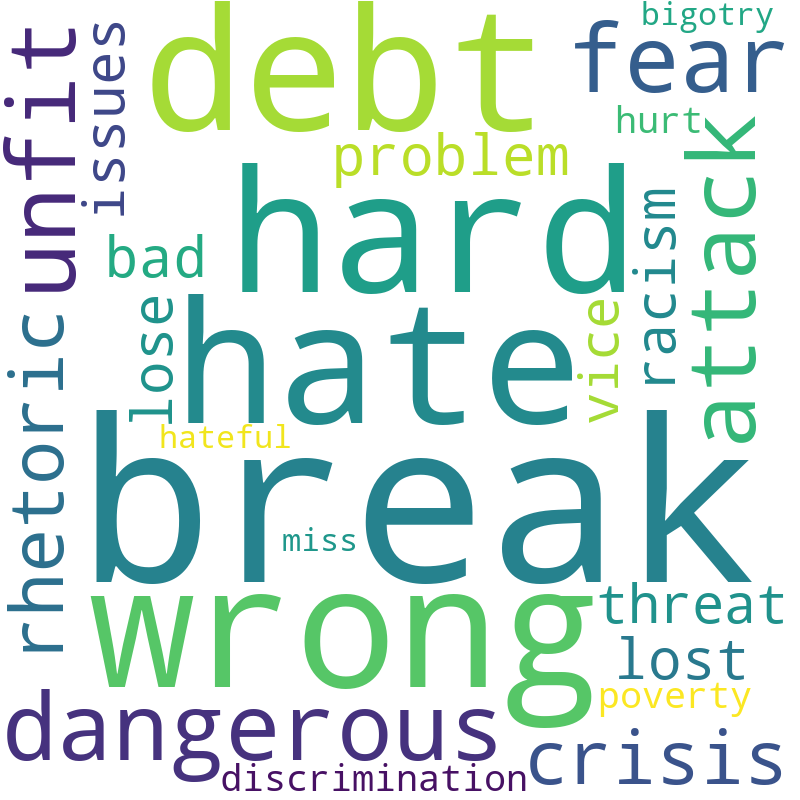
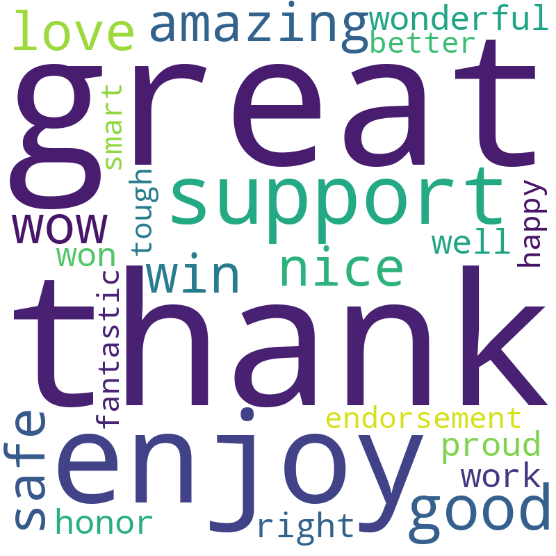

# JCG-CEBD-1160-Project
# Tweet Analysis

| Name | Date |
|:-------|:---------------|
|Jonathan C. Galindez|2019 November 23, 2019|

### Resources
Your repository should include the following:

- Python script for your analysis: `Clinton_Logistic_Regression.py, Trump_Logistic_Regression.py  `   
- Results figure/saved file:  `figures/`
- Dockerfile for your experiment: `Dockerfile`
- runtime-instructions in a file named RUNME.md

### Research Question

Can I predict the level of retweet based on the sentiment score, day and time and the number of users mentioned in the tweet. 

### Abstract

This paper outlines how to data mine a twitter post dataset and produce a sentiment analysis that can provide insights to the value of every tweet. Composing a perfect tweet that can get the attention of the netizens is a big challenge causing many organizations including popular personalities both in entertainment and politics, to hire a social media manager to make sure all postings are effectively written with an objective to be retweeted multiple times. In this premise, I have created a model that will **predict the retweetable level of a tweet** based on favorite count, **sentiment score** using VADER Sentiment ([1](https://www.geeksforgeeks.org/python-sentiment-analysis-using-vader/ "VADER Sentiment Link!")). I have added the day, time period and the number of "@mention" (other important users mentioned) in the tweet as part of the features to be tested using logistic regression model [2].  The result has shown a promising indication, that the features used can predict retweetability level with acceptable accuracy. 

### Introduction

In the age of social media, every word matters, especially since these words now have a global reach. Every post can have a possible positive or negative effect on its audience. Twitter, a social media network that gives a free platform for every user, can have an underlying influence over our behaviour. For instance, the words used by 2016 US election candidates, Donald Trump and Hillary Clinton, helped steer public opinion as they advertised themselves to the nation through thousands of tweets. Using data from these tweets, my goal is to see if the sentiment of the tweet is a determinant factor of the resulting level of retweets. 

The dataset, with 5071 rows and 28 columns, consists of the tweets of Hillary Clinton and Donald Trump from April 2016 to September 2016.  I have downloaded it from Kaggle ([3](https://www.kaggle.com/benhamner/clinton-trump-tweets "Kaggle Link!")), a company that attracts, nurtures, trains and challenge data scientists from all around the world to solve data science, machine learning and predictive analytics problems.

### Methods

To prepare the features, I have performed an extensive cleaning of the dataset that includes feature selection, extraction and transformation. I have selected the ordinal logistic regression model ([Pseudocode link](https://scikit-learn.org/stable/modules/generated/sklearn.linear_model.LogisticRegression.html "Logistic Regression Link!")) to do the prediction as my predicted value is categorical that has 4 ordinal categories namely, 1 for 2000 retweets and below, 2 for 2001-4000, 3 for 4001-6000 and 4 for above 6000. The logistic regression fits my objective to answer my research question whether the featured indenpendent variables mentioned in the **abstract** section, predict the level of virality of the tweet as measured by the retweet level.

### Results

The two twitter acounts we tested here, do not share the same performance related to harmonic mean, the F1 score using the same model. This could be attributed to the occurence of class imbalanced, in this case, the neutral sentiment times can be higher than the positive and negative sentiments. Having said that, the probabilty of predicting the virality of the  tweet measured by the number of retweets based on the specified features yielded a fair result thus can be improved using other techniques. 

| Clinton | Trump |
|:-------|:---------------|
| ||
| ||

### Discussion

It is highly recommended to apply other techniques related to sampling, adjusting classification, introducing new features like counting the positive and negative words used in the tweet (see related works).  

For sentiment analysis, external events can also play a factor and can be extracted to get better prediction (ex. political debate sentiment).

### Related Works

Positive and Negative Words Used:

| Clinton Positive Words| Clinton Negative Words| Trump Positive Words | Trump Negative Words|
|:----------------------|:----------------------|:---------------------|:--------------------| 
||  || |
| |  || 

### References
1. VADER Sentiment - https://www.geeksforgeeks.org/python-sentiment-analysis-using-vader/
2. Logistic Regression - https://scikit-learn.org/stable/modules/generated/sklearn.linear_model.LogisticRegression.html
3. Kaggle Inc. - https://www.kaggle.com/benhamner/clinton-trump-tweets

